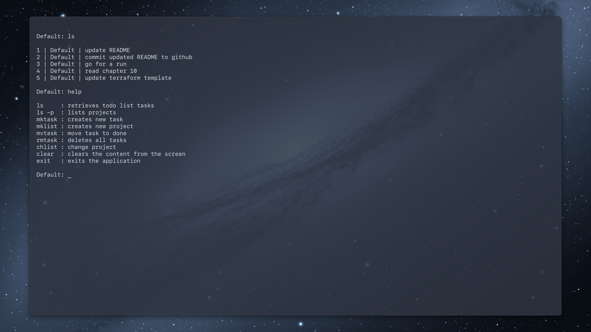

# TermDo 

TermDo is intended to be a simple yet effective way to help increase 
productivity

This project is a simple todo list application within the terminal, the UI design
for TermDo came from my time using PSQL within the terminal

The main feature of TermDo will be the ability separate different projects into
different todo lists

## preview



## prerequisites

| Downloads  | links                                                       |
|------------|-------------------------------------------------------------|
| Java       | [Link](https://www.oracle.com/java/technologies/downloads/) |
| postgresql | [Link](https://www.postgresql.org/download/)                |

> **note** please ensure you import the sql tables and data

## commands to complie and run TermDo

The following command is to complie the code:

```console
javac -d build -cp ./jars/*.jar src/TodoApp.java src/Database.java -Xlint
```

The following command is to run TermDo

```console
java -cp ./build:./jars/postgresql-42.2.20.jar TodoApp
```
